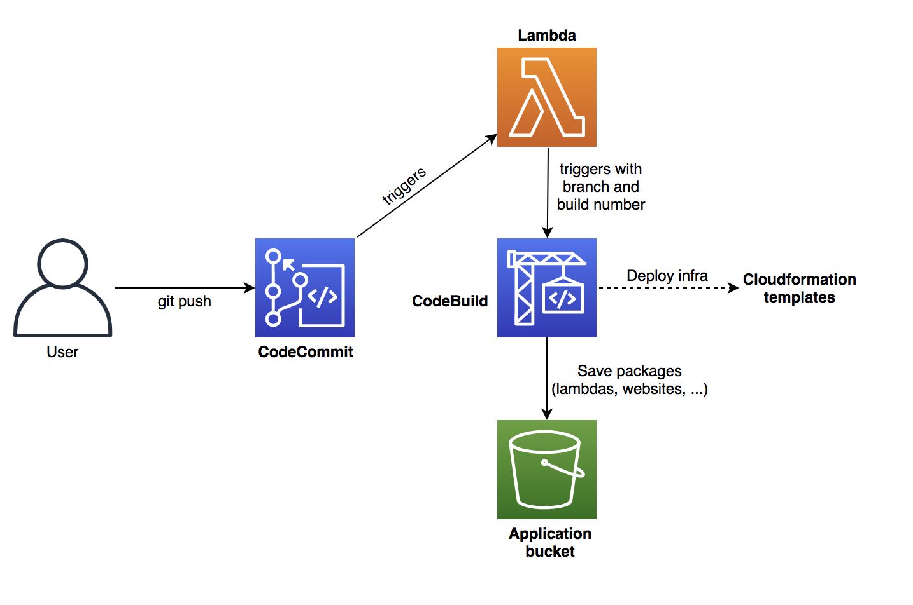

# CI/CD AWS

Create a new project with a CI/CD pipeline using CodeCommit & CodeBuild (AWS).


### Architecture 





### CI/CD workflow

1. The code is saved and versioned in a git repository (Codecommit)
2. On git push event, a lambda function is triggered. It keeps track of the build number and environment (git branch). The last commit is stored into SSM, then a CodeBuild job is triggered (app.py).
3. The CodeBuild job is a python script deploying the infrastructure and the application. The deployment package is saved on S3.


### Setup 

In `init.py`, replace the variable `PROJECT_NAME` by the name of the project (line 18).

Then, run the following command: 

```
python init.py
```

It will create the minimum resources: AWS CodeCommit, CodeBuild, Lambda and S3 bucket (3 Cloudformation stacks). Make sure you have the IAM permissions to set-up these resources. If the command fails, it could be because the S3 bucket name is already taken. In this case, update the project name or the `project-bucket.yaml` file (BucketName).

To update the codebuild job, run:

```
python init.py --codebuild-job
```

!! By default, in order to create any kind of resources, the role attached to the codebuild job has full access to the AWS account. Depending on the use case, the permissions can be restricted in `project.yaml`. !!


### Codebuild job

The codebuild job can be customized depending on the needs (run.py). In this example, the run.py deploy:
- A static website
- A lambda function

For more advanced customization, modify the codebuild job. An example of deploying a serverless API can be found [here](https://github.com/MatthieuBlais/aws-cicd-api). 


### Architecture as a code

Clone the codecommit repository that has been created and copy the folders:
- application
- platform

The codebuild job uses an environment variable to indicate the location of a deployspec (platform/deployspec.yaml). Use this file to create/update (create_stack) or delete (delete_stack) cloudformation stacks. The template path is the path of the original cloudformation template.

The pipeline will automatically update the stack if it has already been deployed once. 

Use the teardown codebuild job to teardown an existing stack.


### Multiple environments

Use the branch name to create different resource names. For example, append `-${Branch}` at the end of the lambda function name to generate a unique name for each branch/environment.

For example, create 3 branches:
- dev
- uat
- nonprod

1. Create a lambda function "hello-world" on "dev" branch and develop the application. The function name would be "hello-world-dev".
2. Merge the dev branch with uat. It will create a lambda function called "hello-world-uat".
3. Once ready to deploy to production, merge "uat" with "master" branch. The lambda function will be named "hello-world-master". 


##### Additional variables

Use an additional ```vars.yaml``` file to define other variables. Group them by branch name and update the codebuild job to fetch the right variables for the right environment. 
An example can be found [here](https://github.com/MatthieuBlais/aws-cicd-api). 


